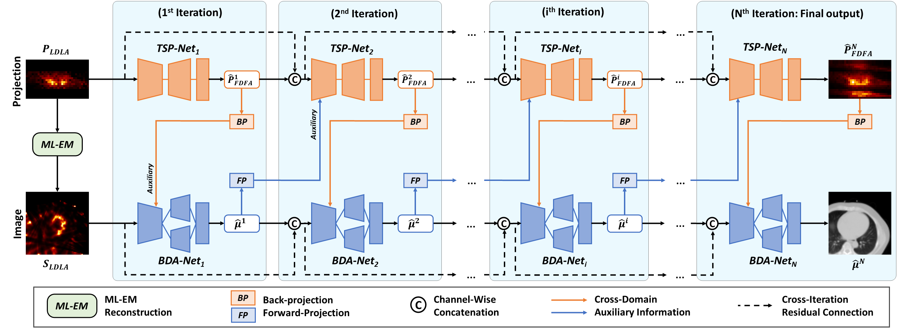
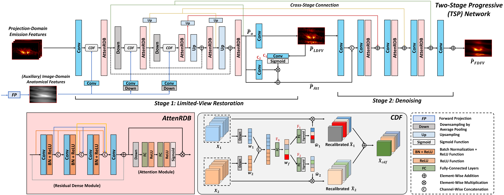
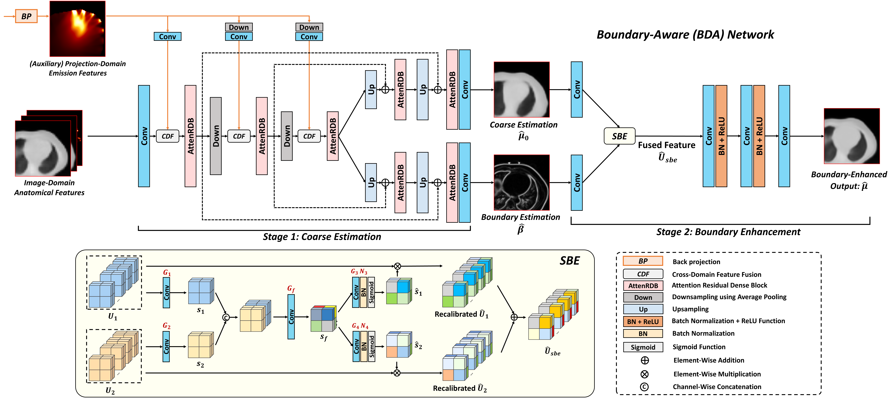

# Dual-Domain Coarse-to-Fine Progressive Network for Simultaneous Denoising, Few-View Reconstruction, and Attenuation Correction of Cardiac SPECT

Xiongchao Chen, Bo Zhou, Xueqi Guo, Huidong Xie, Qiong Liu, James S. Duncan, Albert J. Sinusas, Chi Liu

This repository contains the PyTorch implementation of the Dual-Domain Coarse-to-Fine Progressive Network (DuDoCFNet).

